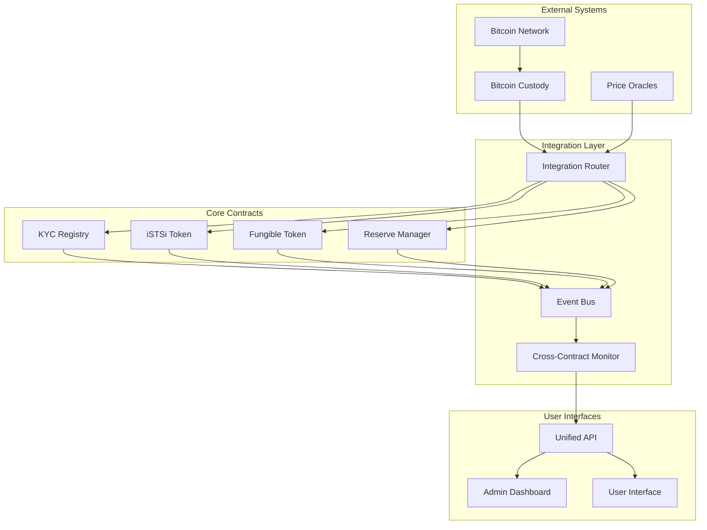

# Integration Features Design Document

## Overview

The Integration Features design creates a unified ecosystem connecting the Bitcoin custody system, iSTSi token contract, KYC registry, and fungible token contracts. The architecture implements a hub-and-spoke pattern with the KYC Registry as the central compliance authority, standardized event-driven communication, and atomic cross-contract operations.

The design prioritizes security through role-based access control, compliance automation, and fail-safe mechanisms while maintaining the modularity of individual contracts. The integration layer provides unified APIs, real-time monitoring, and automated reconciliation between Bitcoin reserves and token supply.

## Architecture

### High-Level Architecture



### Integration Router Pattern

The Integration Router serves as the central orchestrator for cross-contract operations:

```rust
#[contract]
pub struct IntegrationRouter;

#[contracttype]
pub struct RouterConfig {
    pub kyc_registry: Address,
    pub istsi_token: Address,
    pub fungible_token: Address,
    pub reserve_manager: Address,
    pub admin: Address,
    pub paused: bool,
}

#[contracttype]
pub enum IntegrationOperation {
    BitcoinDeposit {
        user: Address,
        btc_amount: u64,
        btc_tx_hash: BytesN<32>,
    },
    TokenWithdrawal {
        user: Address,
        token_amount: u64,
        btc_address: String,
    },
    CrossTokenExchange {
        user: Address,
        from_token: Address,
        to_token: Address,
        amount: u64,
    },
}
```

## Components and Interfaces

### 1. Integration Router Contract

**Purpose**: Central orchestrator for all cross-contract operations

**Key Functions**:

- `execute_bitcoin_deposit()` - Processes Bitcoin deposits with KYC verification
- `execute_token_withdrawal()` - Handles token redemption for Bitcoin
- `execute_cross_token_exchange()` - Manages token-to-token exchanges
- `update_contract_addresses()` - Admin function to update connected contracts
- `emergency_pause()` - Circuit breaker for system-wide halt

**Security Features**:

- Role-based access control with admin/operator roles
- Reentrancy guards on all external calls
- Input validation and sanitization
- Emergency pause mechanism

### 2. Enhanced KYC Registry

**Purpose**: Centralized compliance authority with integration hooks

**New Integration Functions**:

```rust
// Integration-specific functions
pub fn verify_operation_compliance(
    env: Env,
    user: Address,
    operation: OperationType,
    amount: u64,
    counterparty: Option<Address>
) -> Result<bool, KYCError>;

pub fn batch_compliance_check(
    env: Env,
    operations: Vec<ComplianceCheck>
) -> Vec<ComplianceResult>;

pub fn register_integration_event(
    env: Env,
    user: Address,
    operation: OperationType,
    amount: u64,
    metadata: Map<String, String>
) -> Result<(), KYCError>;
```

**Enhanced Features**:

- Real-time compliance verification for all operations
- Batch processing for multiple compliance checks
- Integration event logging for audit trails
- Automated risk scoring based on transaction patterns

### 3. Extended iSTSi Token Contract

**Purpose**: Bitcoin-backed token with integration capabilities

**New Integration Functions**:

```rust
// Integration-aware minting/burning
pub fn integrated_mint(
    env: Env,
    to: Address,
    amount: u64,
    btc_tx_hash: BytesN<32>,
    compliance_proof: BytesN<32>
) -> Result<(), TokenError>;

pub fn integrated_burn(
    env: Env,
    from: Address,
    amount: u64,
    btc_address: String,
    compliance_proof: BytesN<32>
) -> Result<BytesN<32>, TokenError>; // Returns withdrawal ID

// Cross-contract transfer with compliance
pub fn compliance_transfer(
    env: Env,
    from: Address,
    to: Address,
    amount: u64
) -> Result<(), TokenError>;
```

**Integration Features**:

- Automatic KYC verification before all operations
- Bitcoin transaction linking for audit trails
- Reserve validation before minting
- Cross-contract event emission

### 4. Reserve Manager Contract

**Purpose**: Manages Bitcoin reserves and proof-of-reserves

**Core Functions**:

```rust
pub fn register_bitcoin_deposit(
    env: Env,
    tx_hash: BytesN<32>,
    amount: u64,
    confirmations: u32
) -> Result<(), ReserveError>;

pub fn process_bitcoin_withdrawal(
    env: Env,
    withdrawal_id: BytesN<32>,
    btc_address: String,
    amount: u64
) -> Result<BytesN<32>, ReserveError>; // Returns BTC tx hash

pub fn get_reserve_ratio(env: Env) -> u64; // Returns basis points (10000 = 100%)

pub fn generate_proof_of_reserves(env: Env) -> ProofOfReserves;
```

**Security Features**:

- Multi-signature validation for Bitcoin operations
- Real-time reserve ratio monitoring
- Automated alerts for reserve threshold breaches
- Cryptographic proof-of-reserves generation

### 5. Event Bus System

**Purpose**: Standardized event communication between contracts

**Event Types**:

```rust
#[contracttype]
pub enum IntegrationEvent {
    BitcoinDeposit {
        user: Address,
        btc_amount: u64,
        istsi_minted: u64,
        tx_hash: BytesN<32>,
        timestamp: u64,
    },
    TokenWithdrawal {
        user: Address,
        istsi_burned: u64,
        btc_amount: u64,
        withdrawal_id: BytesN<32>,
        timestamp: u64,
    },
    ComplianceAction {
        user: Address,
        action: String,
        reason: String,
        timestamp: u64,
    },
    ReserveUpdate {
        total_btc: u64,
        total_istsi: u64,
        reserve_ratio: u64,
        timestamp: u64,
    },
}
```

## Data Models

### Integration State

```rust
#[contracttype]
pub struct IntegrationState {
    pub router_address: Address,
    pub contracts: Map<String, Address>,
    pub admin: Address,
    pub operators: Vec<Address>,
    pub paused: bool,
    pub emergency_contacts: Vec<Address>,
}

#[contracttype]
pub struct OperationContext {
    pub operation_id: BytesN<32>,
    pub user: Address,
    pub operation_type: OperationType,
    pub amount: u64,
    pub timestamp: u64,
    pub compliance_checks: Vec<ComplianceResult>,
    pub status: OperationStatus,
}
```

### Cross-Contract Communication

```rust
#[contracttype]
pub struct ContractCall {
    pub target_contract: Address,
    pub function_name: String,
    pub parameters: Vec<Val>,
    pub expected_return_type: String,
}

#[contracttype]
pub struct BatchOperation {
    pub operation_id: BytesN<32>,
    pub calls: Vec<ContractCall>,
    pub rollback_calls: Vec<ContractCall>,
    pub timeout: u64,
}
```

### Monitoring and Analytics

```rust
#[contracttype]
pub struct SystemMetrics {
    pub total_operations: u64,
    pub successful_operations: u64,
    pub failed_operations: u64,
    pub average_processing_time: u64,
    pub current_reserve_ratio: u64,
    pub last_updated: u64,
}

#[contracttype]
pub struct AlertConfig {
    pub alert_type: String,
    pub threshold: u64,
    pub recipients: Vec<Address>,
    pub enabled: bool,
}
```

## Error Handling

### Comprehensive Error Types

```rust
#[contracterror]
#[derive(Copy, Clone, Debug, Eq, PartialEq)]
pub enum IntegrationError {
    // Authentication & Authorization
    Unauthorized = 1,
    InsufficientPermissions = 2,
  
    // Contract Communication
    ContractNotFound = 10,
    ContractCallFailed = 11,
    InvalidContractResponse = 12,
  
    // Compliance & KYC
    ComplianceCheckFailed = 20,
    InsufficientKYCTier = 21,
    AddressBlacklisted = 22,
  
    // Reserve Management
    InsufficientReserves = 30,
    ReserveRatioTooLow = 31,
    BitcoinTransactionFailed = 32,
  
    // Operation Processing
    OperationTimeout = 40,
    InvalidOperationState = 41,
    DuplicateOperation = 42,
  
    // System State
    SystemPaused = 50,
    EmergencyMode = 51,
    MaintenanceMode = 52,
}
```

### Error Recovery Mechanisms

1. **Automatic Retry Logic**: Failed operations are automatically retried with exponential backoff
2. **Rollback Procedures**: Complex operations include rollback instructions for partial failures
3. **Circuit Breakers**: Automatic system pause when error rates exceed thresholds
4. **Manual Override**: Admin functions to resolve stuck operations

## Testing Strategy

### Unit Testing

**Contract-Level Tests**:

- Individual contract function testing
- Input validation and edge cases
- Error condition handling
- Access control verification

**Integration Router Tests**:

- Cross-contract communication
- Operation orchestration
- Error propagation
- State consistency

### Integration Testing

**End-to-End Workflows**:

- Complete Bitcoin deposit flow
- Token withdrawal process
- Cross-token exchange operations
- Compliance enforcement scenarios

**Failure Scenarios**:

- Network partition handling
- Contract upgrade compatibility
- Emergency pause/resume procedures
- Data corruption recovery

### Security Testing

**Attack Vector Testing**:

- Reentrancy attack prevention
- Access control bypass attempts
- Integer overflow/underflow protection
- Front-running mitigation

**Compliance Testing**:

- KYC requirement enforcement
- Transaction limit validation
- Blacklist effectiveness
- Audit trail completeness

### Performance Testing

**Load Testing**:

- High-volume transaction processing
- Concurrent operation handling
- Resource utilization monitoring
- Scalability limits identification

**Stress Testing**:

- System behavior under extreme loads
- Memory and storage constraints
- Network congestion handling
- Recovery time measurement

## Security Considerations

### Access Control Matrix


| Role               | Router Admin | Contract Updates | Emergency Pause | User Operations | Compliance Override |
| -------------------- | -------------- | ------------------ | ----------------- | ----------------- | --------------------- |
| Super Admin        | ✓           | ✓               | ✓              | ✓              | ✓                  |
| System Admin       | ✓           | ✗               | ✓              | ✓              | ✗                  |
| Compliance Officer | ✗           | ✗               | ✓              | ✗              | ✓                  |
| Operator           | ✗           | ✗               | ✗              | ✓              | ✗                  |
| User               | ✗           | ✗               | ✗              | ✓*             | ✗                  |

*Users can only perform operations on their own accounts

### Security Measures

1. **Multi-Signature Requirements**: Critical operations require multiple signatures
2. **Time-Locked Operations**: Major changes have mandatory delay periods
3. **Rate Limiting**: Per-user and system-wide operation limits
4. **Monitoring and Alerting**: Real-time security event detection
5. **Formal Verification**: Critical functions undergo mathematical proof verification

### Audit Trail Requirements

All operations must generate immutable audit logs containing:

- Operation ID and timestamp
- User address and KYC status
- Operation type and parameters
- Compliance check results
- Contract state changes
- Error conditions and resolutions

## Performance Optimization

### Gas Optimization Strategies

1. **Batch Operations**: Group multiple operations to reduce transaction costs
2. **State Packing**: Optimize storage layout to minimize gas usage
3. **Lazy Evaluation**: Defer expensive computations when possible
4. **Caching**: Store frequently accessed data in contract storage

### Scalability Considerations

1. **Horizontal Scaling**: Support for multiple contract instances
2. **Load Balancing**: Distribute operations across available resources
3. **Asynchronous Processing**: Non-blocking operation handling
4. **Data Archiving**: Move historical data to cheaper storage

## Monitoring and Observability

### Key Metrics

1. **Operational Metrics**:

   - Transaction throughput (ops/second)
   - Success/failure rates
   - Average processing time
   - Queue depths
2. **Business Metrics**:

   - Total value locked (TVL)
   - Reserve ratios
   - User growth rates
   - Compliance rates
3. **Security Metrics**:

   - Failed authentication attempts
   - Suspicious transaction patterns
   - Error rates by type
   - System availability

### Alerting Framework

**Critical Alerts** (Immediate Response):

- System-wide failures
- Security breaches
- Reserve ratio below minimum
- Compliance violations

**Warning Alerts** (Monitor Closely):

- High error rates
- Performance degradation
- Unusual transaction patterns
- Resource utilization spikes

**Informational Alerts** (Periodic Review):

- Daily/weekly summaries
- Trend analysis
- Capacity planning data
- User behavior insights
