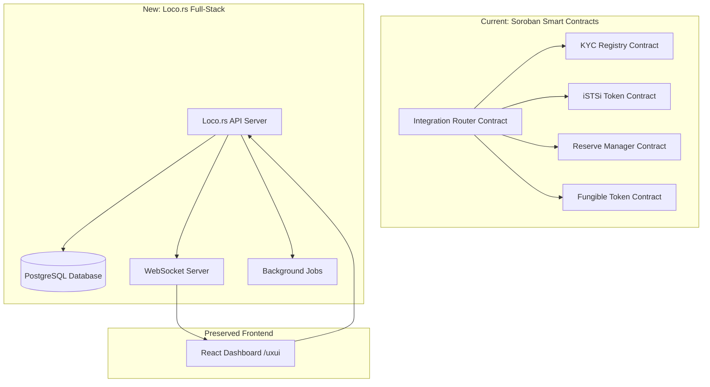

# Loco.rs Full-Stack Integration Design Document

## Overview

This design document outlines the migration from the current Soroban smart contract architecture to a full-stack web application using Loco.rs as the backend framework while preserving the existing React frontend (`/uxui`). The migration transforms the decentralized contract system into a traditional web application with database persistence, RESTful APIs, and real-time WebSocket communication.

The design maintains all existing functionality from the integration-features spec while providing better performance, easier deployment, and more flexible user management through a centralized architecture.

## Architecture Migration Strategy

### Current vs. New Architecture



### Migration Mapping

| Soroban Contract | Loco.rs Component | Database Tables |
|------------------|-------------------|-----------------|
| Integration Router | `controllers/integration.rs` | `operations`, `system_config` |
| KYC Registry | `controllers/kyc.rs` | `users`, `kyc_records`, `compliance_events` |
| iSTSi Token | `controllers/tokens.rs` | `token_balances`, `token_transactions` |
| Reserve Manager | `controllers/reserves.rs` | `bitcoin_reserves`, `proof_of_reserves` |
| Event System | `services/events.rs` + WebSockets | `system_events`, `audit_logs` |

## High-Level Architecture

### Loco.rs Application Structure

```
loco-backend/
├── src/
│   ├── controllers/          # API endpoints
│   │   ├── auth.rs          # Authentication & sessions
│   │   ├── users.rs         # User management
│   │   ├── integration.rs   # Integration operations
│   │   ├── kyc.rs          # KYC & compliance
│   │   ├── tokens.rs       # Token operations
│   │   ├── reserves.rs     # Reserve management
│   │   └── admin.rs        # Admin operations
│   ├── models/              # Database models
│   │   ├── user.rs         # User & authentication
│   │   ├── kyc_record.rs   # KYC compliance data
│   │   ├── token_balance.rs # Token balances
│   │   ├── operation.rs    # System operations
│   │   └── audit_log.rs    # Audit trails
│   ├── services/            # Business logic
│   │   ├── integration_service.rs  # Core integration logic
│   │   ├── kyc_service.rs          # Compliance services
│   │   ├── token_service.rs        # Token operations
│   │   ├── reserve_service.rs      # Reserve management
│   │   ├── username_service.rs     # Username validation
│   │   └── websocket_service.rs    # Real-time updates
│   ├── workers/             # Background jobs
│   │   ├── reconciliation.rs      # Automated reconciliation
│   │   ├── proof_generation.rs    # Proof-of-reserves
│   │   └── compliance_monitor.rs  # Compliance checking
│   └── middleware/          # Custom middleware
│       ├── auth.rs         # Authentication middleware
│       ├── rate_limit.rs   # Rate limiting
│       └── audit.rs        # Audit logging
├── migration/               # Database migrations
├── config/                  # Configuration files
└── static/                  # Serves React build
    └── uxui/               # Built React frontend
```

### Frontend Integration Strategy

The existing React frontend (`/uxui`) will be preserved with minimal changes:

1. **Build Integration**: Loco.rs serves the built React app from `static/uxui/`
2. **API Migration**: Replace Soroban contract calls with HTTP API calls
3. **WebSocket Integration**: Add real-time updates via WebSocket connections
4. **Authentication**: Integrate with Loco.rs session management

## Components and Interfaces

### 1. Authentication System

**Loco.rs Authentication Controller**:
```rust
// controllers/auth.rs
use loco_rs::prelude::*;

#[derive(Debug, Deserialize)]
pub struct LoginRequest {
    pub email: String,
    pub password: String,
}

#[derive(Debug, Serialize)]
pub struct AuthResponse {
    pub token: String,
    pub user: UserResponse,
    pub permissions: Vec<String>,
}

pub async fn login(
    State(ctx): State<AppContext>,
    Json(params): Json<LoginRequest>,
) -> Result<Json<AuthResponse>> {
    // Authenticate user and create JWT session
}

pub async fn register(
    State(ctx): State<AppContext>,
    Json(params): Json<RegisterRequest>,
) -> Result<Json<AuthResponse>> {
    // Create new user with username validation
}
```

**User Model**:
```rust
// models/user.rs
use sea_orm::entity::prelude::*;
use serde::{Deserialize, Serialize};

#[derive(Clone, Debug, PartialEq, DeriveEntityModel, Serialize, Deserialize)]
#[sea_orm(table_name = "users")]
pub struct Model {
    #[sea_orm(primary_key)]
    pub id: i32,
    pub email: String,
    pub username: String,
    pub password_hash: String,
    pub role: UserRole,
    pub kyc_tier: i32,
    pub is_active: bool,
    pub created_at: DateTimeWithTimeZone,
    pub updated_at: DateTimeWithTimeZone,
}

#[derive(Debug, Clone, PartialEq, Eq, EnumIter, DeriveActiveEnum, Serialize, Deserialize)]
#[sea_orm(rs_type = "String", db_type = "Enum", enum_name = "user_role")]
pub enum UserRole {
    #[sea_orm(string_value = "admin")]
    Admin,
    #[sea_orm(string_value = "operator")]
    Operator,
    #[sea_orm(string_value = "compliance_officer")]
    ComplianceOfficer,
    #[sea_orm(string_value = "viewer")]
    Viewer,
}
```

### 2. Integration Operations Controller

**Migration from Integration Router Contract**:
```rust
// controllers/integration.rs
use loco_rs::prelude::*;

#[derive(Debug, Deserialize)]
pub struct BitcoinDepositRequest {
    pub btc_amount: u64,
    pub btc_tx_hash: String,
    pub confirmations: u32,
}

#[derive(Debug, Serialize)]
pub struct OperationResponse {
    pub operation_id: String,
    pub status: OperationStatus,
    pub details: serde_json::Value,
}

pub async fn execute_bitcoin_deposit(
    State(ctx): State<AppContext>,
    auth: auth::JWT,
    Json(params): Json<BitcoinDepositRequest>,
) -> Result<Json<OperationResponse>> {
    // Replicate the Soroban contract logic in Rust
    let service = IntegrationService::new(&ctx.db);
    
    // 1. Verify KYC compliance
    let kyc_result = service.verify_kyc_compliance(&auth.claims.sub, &params).await?;
    
    // 2. Validate Bitcoin transaction
    let btc_validation = service.validate_bitcoin_deposit(&params).await?;
    
    // 3. Check reserve capacity
    let reserve_check = service.check_reserve_capacity(&params).await?;
    
    // 4. Execute atomic deposit operation
    let operation = service.execute_atomic_deposit(auth.claims.sub, params).await?;
    
    Ok(Json(OperationResponse {
        operation_id: operation.id,
        status: operation.status,
        details: operation.to_json(),
    }))
}
```

### 3. KYC and Compliance System

**KYC Service (replaces KYC Registry Contract)**:
```rust
// services/kyc_service.rs
use crate::models::{kyc_record, user};

pub struct KycService<'a> {
    db: &'a DatabaseConnection,
}

impl<'a> KycService<'a> {
    pub async fn verify_compliance(
        &self,
        user_id: i32,
        operation_type: OperationType,
        amount: u64,
    ) -> Result<ComplianceResult> {
        // Replicate Soroban KYC contract logic
        let user = user::Entity::find_by_id(user_id).one(self.db).await?;
        let kyc_record = kyc_record::Entity::find()
            .filter(kyc_record::Column::UserId.eq(user_id))
            .one(self.db)
            .await?;
            
        // Apply tier-based limits and compliance rules
        match kyc_record.tier {
            1 => self.check_tier1_limits(amount, operation_type).await,
            2 => self.check_tier2_limits(amount, operation_type).await,
            3 => self.check_tier3_limits(amount, operation_type).await,
            4 => self.check_tier4_limits(amount, operation_type).await,
            _ => Err(Error::InsufficientKycTier),
        }
    }
    
    pub async fn log_compliance_event(
        &self,
        user_id: i32,
        event_type: ComplianceEventType,
        details: serde_json::Value,
    ) -> Result<()> {
        // Create audit trail entry
    }
}
```

### 4. Token Management System

**Token Service (replaces iSTSi Token Contract)**:
```rust
// services/token_service.rs
use crate::models::token_balance;

pub struct TokenService<'a> {
    db: &'a DatabaseConnection,
}

impl<'a> TokenService<'a> {
    pub async fn mint_istsi_tokens(
        &self,
        user_id: i32,
        btc_amount: u64,
        btc_tx_hash: String,
    ) -> Result<TokenTransaction> {
        // Replicate Soroban token minting logic
        let istsi_amount = btc_amount * 100_000_000; // 1:100M ratio
        
        // Update user balance atomically
        let mut balance = token_balance::Entity::find()
            .filter(token_balance::Column::UserId.eq(user_id))
            .filter(token_balance::Column::TokenType.eq("iSTSi"))
            .one(self.db)
            .await?
            .unwrap_or_default();
            
        balance.amount += istsi_amount;
        balance.save(self.db).await?;
        
        // Create transaction record
        let transaction = TokenTransaction::new(
            user_id,
            "iSTSi",
            istsi_amount,
            TransactionType::Mint,
            Some(btc_tx_hash),
        );
        
        transaction.save(self.db).await
    }
    
    pub async fn burn_istsi_tokens(
        &self,
        user_id: i32,
        istsi_amount: u64,
        btc_address: String,
    ) -> Result<String> {
        // Replicate Soroban token burning logic with withdrawal ID
    }
}
```

### 5. Reserve Management System

**Reserve Service (replaces Reserve Manager Contract)**:
```rust
// services/reserve_service.rs
use crate::models::bitcoin_reserve;

pub struct ReserveService<'a> {
    db: &'a DatabaseConnection,
}

impl<'a> ReserveService<'a> {
    pub async fn register_bitcoin_deposit(
        &self,
        tx_hash: String,
        amount: u64,
        confirmations: u32,
    ) -> Result<()> {
        // Replicate Soroban reserve tracking logic
        let reserve = bitcoin_reserve::ActiveModel {
            tx_hash: Set(tx_hash),
            amount: Set(amount as i64),
            confirmations: Set(confirmations as i32),
            status: Set(ReserveStatus::Confirmed),
            created_at: Set(chrono::Utc::now().into()),
            ..Default::default()
        };
        
        reserve.insert(self.db).await?;
        Ok(())
    }
    
    pub async fn get_reserve_ratio(&self) -> Result<f64> {
        // Calculate current reserve ratio
        let total_btc = self.get_total_bitcoin_reserves().await?;
        let total_istsi = self.get_total_istsi_supply().await?;
        
        Ok((total_btc as f64 * 100_000_000.0) / total_istsi as f64)
    }
    
    pub async fn generate_proof_of_reserves(&self) -> Result<ProofOfReserves> {
        // Replicate Soroban proof generation logic
    }
}
```

### 6. WebSocket Real-Time Updates

**WebSocket Service**:
```rust
// services/websocket_service.rs
use loco_rs::prelude::*;
use tokio_tungstenite::tungstenite::Message;

pub struct WebSocketService {
    connections: Arc<Mutex<HashMap<String, WebSocketConnection>>>,
}

impl WebSocketService {
    pub async fn broadcast_system_update(&self, update: SystemUpdate) {
        let message = serde_json::to_string(&update).unwrap();
        let connections = self.connections.lock().await;
        
        for (_, connection) in connections.iter() {
            if connection.has_permission(&update.required_permission) {
                let _ = connection.send(Message::Text(message.clone())).await;
            }
        }
    }
    
    pub async fn broadcast_operation_update(
        &self,
        operation_id: String,
        status: OperationStatus,
    ) {
        // Send real-time operation updates to dashboard
    }
}
```

### 7. Username Validation Integration

**Username Service**:
```rust
// services/username_service.rs
pub struct UsernameService<'a> {
    db: &'a DatabaseConnection,
    http_client: reqwest::Client,
}

impl<'a> UsernameService<'a> {
    pub async fn validate_username(&self, username: &str) -> Result<ValidationResult> {
        // Implement the username validation spec requirements
        
        // 1. Client-side validation
        let format_result = self.validate_format(username)?;
        if !format_result.is_valid {
            return Ok(format_result);
        }
        
        // 2. Check reserved names
        if self.is_reserved_name(username).await? {
            return Ok(ValidationResult::reserved(username));
        }
        
        // 3. Check database for existing users
        if self.username_exists(username).await? {
            return Ok(ValidationResult::taken(username));
        }
        
        // 4. External API validation (with fallback)
        match self.check_external_availability(username).await {
            Ok(result) => Ok(result),
            Err(_) => {
                // Fallback to local validation only
                Ok(ValidationResult::available_with_fallback(username))
            }
        }
    }
    
    pub async fn get_username_suggestions(&self, username: &str) -> Result<Vec<String>> {
        // Generate alternative username suggestions
    }
}
```

## Data Models and Database Schema

### Database Migration Strategy

**Migration from Soroban Storage to PostgreSQL**:

```sql
-- migration/001_initial_schema.sql

-- Users and Authentication
CREATE TABLE users (
    id SERIAL PRIMARY KEY,
    email VARCHAR(255) UNIQUE NOT NULL,
    username VARCHAR(50) UNIQUE NOT NULL,
    password_hash VARCHAR(255) NOT NULL,
    role user_role NOT NULL DEFAULT 'viewer',
    kyc_tier INTEGER DEFAULT 0,
    is_active BOOLEAN DEFAULT true,
    created_at TIMESTAMPTZ DEFAULT NOW(),
    updated_at TIMESTAMPTZ DEFAULT NOW()
);

-- KYC and Compliance
CREATE TABLE kyc_records (
    id SERIAL PRIMARY KEY,
    user_id INTEGER REFERENCES users(id),
    tier INTEGER NOT NULL,
    status kyc_status NOT NULL,
    verification_data JSONB,
    verified_at TIMESTAMPTZ,
    expires_at TIMESTAMPTZ,
    created_at TIMESTAMPTZ DEFAULT NOW()
);

-- Token Balances and Transactions
CREATE TABLE token_balances (
    id SERIAL PRIMARY KEY,
    user_id INTEGER REFERENCES users(id),
    token_type VARCHAR(20) NOT NULL,
    amount BIGINT NOT NULL DEFAULT 0,
    locked_amount BIGINT DEFAULT 0,
    updated_at TIMESTAMPTZ DEFAULT NOW(),
    UNIQUE(user_id, token_type)
);

CREATE TABLE token_transactions (
    id SERIAL PRIMARY KEY,
    user_id INTEGER REFERENCES users(id),
    token_type VARCHAR(20) NOT NULL,
    amount BIGINT NOT NULL,
    transaction_type transaction_type NOT NULL,
    btc_tx_hash VARCHAR(64),
    operation_id VARCHAR(64),
    status transaction_status DEFAULT 'pending',
    created_at TIMESTAMPTZ DEFAULT NOW()
);

-- Bitcoin Reserves
CREATE TABLE bitcoin_reserves (
    id SERIAL PRIMARY KEY,
    tx_hash VARCHAR(64) UNIQUE NOT NULL,
    amount BIGINT NOT NULL,
    confirmations INTEGER DEFAULT 0,
    status reserve_status DEFAULT 'pending',
    created_at TIMESTAMPTZ DEFAULT NOW()
);

-- System Operations
CREATE TABLE operations (
    id SERIAL PRIMARY KEY,
    operation_id VARCHAR(64) UNIQUE NOT NULL,
    user_id INTEGER REFERENCES users(id),
    operation_type operation_type NOT NULL,
    status operation_status DEFAULT 'pending',
    parameters JSONB,
    result JSONB,
    error_message TEXT,
    created_at TIMESTAMPTZ DEFAULT NOW(),
    completed_at TIMESTAMPTZ
);

-- Audit Logs
CREATE TABLE audit_logs (
    id SERIAL PRIMARY KEY,
    user_id INTEGER REFERENCES users(id),
    action VARCHAR(100) NOT NULL,
    resource_type VARCHAR(50),
    resource_id VARCHAR(100),
    details JSONB,
    ip_address INET,
    user_agent TEXT,
    created_at TIMESTAMPTZ DEFAULT NOW()
);
```

### Model Definitions

**Operation Model**:
```rust
// models/operation.rs
#[derive(Clone, Debug, PartialEq, DeriveEntityModel, Serialize, Deserialize)]
#[sea_orm(table_name = "operations")]
pub struct Model {
    #[sea_orm(primary_key)]
    pub id: i32,
    pub operation_id: String,
    pub user_id: i32,
    pub operation_type: OperationType,
    pub status: OperationStatus,
    pub parameters: serde_json::Value,
    pub result: Option<serde_json::Value>,
    pub error_message: Option<String>,
    pub created_at: DateTimeWithTimeZone,
    pub completed_at: Option<DateTimeWithTimeZone>,
}

#[derive(Debug, Clone, PartialEq, Eq, EnumIter, DeriveActiveEnum, Serialize, Deserialize)]
#[sea_orm(rs_type = "String", db_type = "Enum", enum_name = "operation_type")]
pub enum OperationType {
    #[sea_orm(string_value = "bitcoin_deposit")]
    BitcoinDeposit,
    #[sea_orm(string_value = "token_withdrawal")]
    TokenWithdrawal,
    #[sea_orm(string_value = "cross_token_exchange")]
    CrossTokenExchange,
    #[sea_orm(string_value = "reconciliation")]
    Reconciliation,
}
```

## Error Handling and Migration

### Error Mapping from Soroban to Loco.rs

**Soroban Contract Errors → HTTP Status Codes**:
```rust
// Error mapping from integration-features contracts
impl From<IntegrationError> for loco_rs::Error {
    fn from(err: IntegrationError) -> Self {
        match err {
            IntegrationError::Unauthorized => {
                loco_rs::Error::Unauthorized("Authentication required".to_string())
            }
            IntegrationError::InsufficientPermissions => {
                loco_rs::Error::Forbidden("Insufficient permissions".to_string())
            }
            IntegrationError::ComplianceCheckFailed => {
                loco_rs::Error::BadRequest("KYC compliance check failed".to_string())
            }
            IntegrationError::InsufficientReserves => {
                loco_rs::Error::BadRequest("Insufficient Bitcoin reserves".to_string())
            }
            IntegrationError::SystemPaused => {
                loco_rs::Error::ServiceUnavailable("System is paused for maintenance".to_string())
            }
            // ... map all Soroban errors to appropriate HTTP responses
        }
    }
}
```

### Graceful Migration Strategy

**Phase 1: Parallel Operation**
- Deploy Loco.rs backend alongside existing Soroban contracts
- Migrate read-only operations first (dashboard data, reporting)
- Maintain Soroban contracts for critical operations

**Phase 2: Write Operation Migration**
- Migrate user registration and authentication
- Move Bitcoin deposit/withdrawal workflows
- Implement real-time synchronization between systems

**Phase 3: Complete Migration**
- Migrate all remaining operations
- Decommission Soroban contracts
- Full Loco.rs operation

## Testing Strategy

### Migration Testing

**Data Migration Tests**:
```rust
#[cfg(test)]
mod migration_tests {
    use super::*;
    
    #[tokio::test]
    async fn test_soroban_to_postgres_migration() {
        // Test data migration from Soroban storage to PostgreSQL
        let soroban_data = load_soroban_test_data().await;
        let migrated_data = migrate_to_postgres(soroban_data).await.unwrap();
        
        assert_eq!(soroban_data.user_count, migrated_data.user_count);
        assert_eq!(soroban_data.total_reserves, migrated_data.total_reserves);
    }
    
    #[tokio::test]
    async fn test_api_compatibility() {
        // Ensure new API responses match frontend expectations
        let response = test_bitcoin_deposit_api().await;
        assert_frontend_compatibility(response);
    }
}
```

**Integration Tests**:
```rust
#[tokio::test]
async fn test_complete_bitcoin_deposit_workflow() {
    let app = create_test_app().await;
    
    // 1. User authentication
    let auth_response = app.post("/auth/login")
        .json(&LoginRequest { email: "test@example.com", password: "password" })
        .send()
        .await;
    
    // 2. Bitcoin deposit
    let deposit_response = app.post("/integration/bitcoin-deposit")
        .bearer_token(&auth_response.token)
        .json(&BitcoinDepositRequest {
            btc_amount: 100000000, // 1 BTC
            btc_tx_hash: "abc123...".to_string(),
            confirmations: 6,
        })
        .send()
        .await;
    
    assert_eq!(deposit_response.status(), 200);
    
    // 3. Verify token balance update
    let balance_response = app.get("/tokens/balance")
        .bearer_token(&auth_response.token)
        .send()
        .await;
    
    let balance: TokenBalance = balance_response.json().await;
    assert_eq!(balance.istsi_amount, 10_000_000_000_000_000); // 100M iSTSi tokens
}
```

## Frontend Integration

### API Client Migration

**Replace Soroban Contract Calls with HTTP API**:
```typescript
// uxui/src/services/api.ts - Replace contract calls

// OLD: Soroban contract call
// const result = await contract.execute_bitcoin_deposit({
//   btc_amount: amount,
//   btc_tx_hash: txHash,
// });

// NEW: HTTP API call
class ApiClient {
  private baseUrl: string;
  private token: string | null = null;

  async executeBitcoinDeposit(params: BitcoinDepositRequest): Promise<OperationResponse> {
    const response = await fetch(`${this.baseUrl}/integration/bitcoin-deposit`, {
      method: 'POST',
      headers: {
        'Content-Type': 'application/json',
        'Authorization': `Bearer ${this.token}`,
      },
      body: JSON.stringify(params),
    });
    
    if (!response.ok) {
      throw new Error(`API Error: ${response.status}`);
    }
    
    return response.json();
  }

  async getSystemOverview(): Promise<SystemState> {
    const response = await fetch(`${this.baseUrl}/system/overview`, {
      headers: { 'Authorization': `Bearer ${this.token}` },
    });
    return response.json();
  }
}
```

### WebSocket Integration

**Add Real-Time Updates to React Components**:
```typescript
// uxui/src/hooks/useWebSocket.ts
import { useEffect, useState } from 'react';

export function useWebSocket(url: string, token: string) {
  const [socket, setSocket] = useState<WebSocket | null>(null);
  const [systemState, setSystemState] = useState<SystemState | null>(null);

  useEffect(() => {
    const ws = new WebSocket(`${url}?token=${token}`);
    
    ws.onmessage = (event) => {
      const update = JSON.parse(event.data);
      
      switch (update.type) {
        case 'system_state':
          setSystemState(update.data);
          break;
        case 'operation_update':
          // Handle operation status updates
          break;
        case 'alert':
          // Handle new alerts
          break;
      }
    };
    
    setSocket(ws);
    
    return () => ws.close();
  }, [url, token]);

  return { socket, systemState };
}
```

### Component Updates

**Minimal Changes to Existing Components**:
```typescript
// uxui/src/components/SystemOverview.tsx - Updated to use HTTP API
export function SystemOverview() {
  const { token } = useAuth();
  const { systemState } = useWebSocket('ws://localhost:3000/ws', token);
  const [loading, setLoading] = useState(true);

  // Replace contract polling with WebSocket updates
  // Most existing UI logic remains unchanged
  
  return (
    <div className="space-y-6">
      {/* Existing UI components work as-is */}
      <Card>
        <CardHeader>
          <CardTitle>System Status</CardTitle>
        </CardHeader>
        <CardContent>
          <div className="grid grid-cols-4 gap-4">
            <MetricCard
              title="Total Operations"
              value={systemState?.totalOperations || 0}
              icon={<Activity className="w-4 h-4" />}
            />
            {/* ... rest of existing UI */}
          </div>
        </CardContent>
      </Card>
    </div>
  );
}
```

## Deployment and Configuration

### Loco.rs Configuration

**Development Configuration**:
```yaml
# config/development.yaml
server:
  port: 3000
  host: 0.0.0.0

database:
  uri: postgres://localhost/loco_integration_dev
  auto_migrate: true

auth:
  jwt:
    secret: "development-secret-key"
    expiration: 86400 # 24 hours

frontend:
  serve_static: true
  static_dir: "static/uxui"
  dev_proxy: "http://localhost:5173" # Vite dev server

bitcoin:
  network: "testnet"
  rpc_url: "http://localhost:18332"
  
external_apis:
  username_validation:
    url: "https://api.example.com/username-check"
    timeout: 5000
    retry_attempts: 3
```

**Production Configuration**:
```yaml
# config/production.yaml
server:
  port: ${PORT}
  host: 0.0.0.0

database:
  uri: ${DATABASE_URL}
  auto_migrate: false

auth:
  jwt:
    secret: ${JWT_SECRET}
    expiration: 3600 # 1 hour

frontend:
  serve_static: true
  static_dir: "static/uxui"

bitcoin:
  network: "mainnet"
  rpc_url: ${BITCOIN_RPC_URL}
```

### Docker Deployment

**Dockerfile**:
```dockerfile
# Build React frontend
FROM node:18 AS frontend-builder
WORKDIR /app/uxui
COPY uxui/package*.json ./
RUN npm ci
COPY uxui/ ./
RUN npm run build

# Build Loco.rs backend
FROM rust:1.75 AS backend-builder
WORKDIR /app
COPY Cargo.toml Cargo.lock ./
COPY src/ ./src/
RUN cargo build --release

# Final image
FROM debian:bookworm-slim
RUN apt-get update && apt-get install -y ca-certificates && rm -rf /var/lib/apt/lists/*

WORKDIR /app
COPY --from=backend-builder /app/target/release/loco-integration ./
COPY --from=frontend-builder /app/uxui/dist ./static/uxui/
COPY config/ ./config/

EXPOSE 3000
CMD ["./loco-integration", "start"]
```

This design provides a comprehensive migration path from the Soroban smart contract architecture to a full-stack Loco.rs application while preserving all existing functionality and the React frontend.