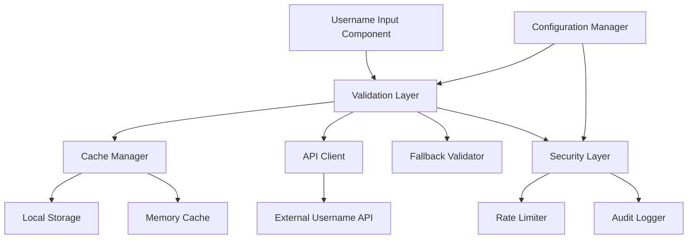
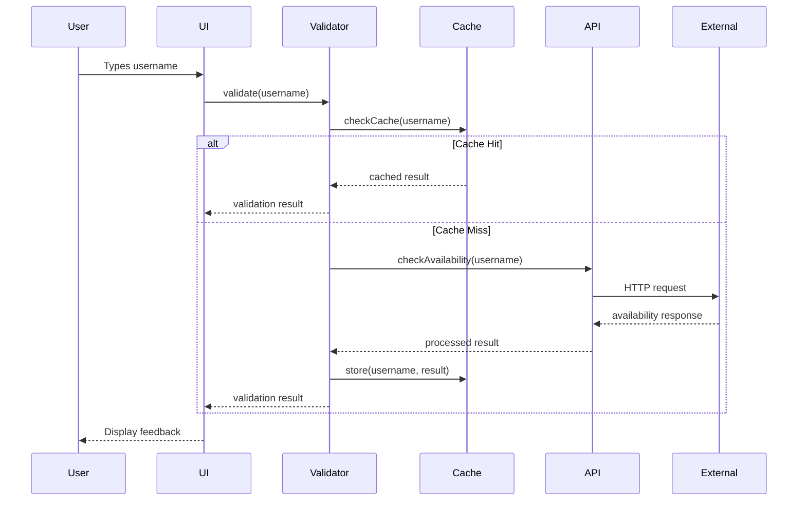

# Username Validation Design Document

## Overview

The username validation system provides real-time validation of usernames against remote services to ensure availability and compliance with platform standards. The system is designed as a client-side service with robust fallback mechanisms, caching strategies, and security measures to prevent abuse.

The architecture follows a layered approach with clear separation between validation logic, API communication, caching, and user interface components. The system integrates seamlessly with the existing React/TypeScript frontend while providing extensible backend validation capabilities.

## Architecture

### High-Level Architecture



### Component Interaction Flow



## Components and Interfaces

### 1. Username Validation Service

**Primary Interface:**
```typescript
interface UsernameValidationService {
  validateUsername(username: string): Promise<ValidationResult>;
  getSuggestions(username: string): Promise<string[]>;
  clearCache(): void;
  configure(config: ValidationConfig): void;
}

interface ValidationResult {
  isValid: boolean;
  isAvailable: boolean;
  errors: ValidationError[];
  suggestions?: string[];
  cached: boolean;
  timestamp: number;
}

interface ValidationError {
  type: 'format' | 'length' | 'reserved' | 'taken' | 'profanity' | 'network';
  message: string;
  field?: string;
}
```

**Implementation Details:**
- Debounced validation with 300ms delay
- Concurrent validation limit of 3 requests
- Automatic retry with exponential backoff
- Circuit breaker pattern for external API failures

### 2. API Client Layer

**Interface:**
```typescript
interface UsernameAPIClient {
  checkAvailability(username: string): Promise<AvailabilityResponse>;
  getSuggestions(username: string, count: number): Promise<string[]>;
  healthCheck(): Promise<boolean>;
}

interface AvailabilityResponse {
  username: string;
  available: boolean;
  reason?: string;
  suggestions?: string[];
}
```

**Implementation Features:**
- HTTP client with timeout configuration (5s default)
- Request/response interceptors for logging
- Automatic retry logic with jitter
- Request deduplication for identical concurrent requests

### 3. Cache Management System

**Interface:**
```typescript
interface CacheManager {
  get(key: string): Promise<CachedValidation | null>;
  set(key: string, value: ValidationResult, ttl?: number): Promise<void>;
  invalidate(pattern: string): Promise<void>;
  clear(): Promise<void>;
  getStats(): CacheStats;
}

interface CachedValidation {
  result: ValidationResult;
  timestamp: number;
  ttl: number;
}
```

**Cache Strategy:**
- Two-tier caching: Memory (L1) + LocalStorage (L2)
- Memory cache: 100 entries, 30-second TTL
- LocalStorage cache: 500 entries, 5-minute TTL
- LRU eviction policy for both tiers

### 4. Security and Rate Limiting

**Interface:**
```typescript
interface SecurityManager {
  checkRateLimit(identifier: string): Promise<boolean>;
  logValidationAttempt(username: string, result: ValidationResult): void;
  detectSuspiciousActivity(identifier: string): boolean;
  generateChallengeToken(): string;
}
```

**Security Features:**
- Rate limiting: 10 requests per minute per IP
- Progressive delays for repeated failures
- CAPTCHA integration for suspicious patterns
- Request fingerprinting to detect automation

### 5. Configuration Management

**Interface:**
```typescript
interface ValidationConfig {
  apiEndpoint: string;
  timeout: number;
  retryAttempts: number;
  cacheSettings: CacheConfig;
  rateLimit: RateLimitConfig;
  validationRules: ValidationRules;
  reservedNames: string[];
}

interface ValidationRules {
  minLength: number;
  maxLength: number;
  allowedCharacters: RegExp;
  profanityFilter: boolean;
  customPatterns: RegExp[];
}
```

## Data Models

### Username Validation State

```typescript
interface UsernameValidationState {
  username: string;
  status: 'idle' | 'validating' | 'valid' | 'invalid' | 'error';
  result: ValidationResult | null;
  suggestions: string[];
  loading: boolean;
  error: string | null;
  lastValidated: number;
}
```

### API Response Models

```typescript
interface ExternalAPIResponse {
  data: {
    username: string;
    available: boolean;
    suggestions?: string[];
  };
  meta: {
    timestamp: string;
    requestId: string;
  };
  errors?: APIError[];
}

interface APIError {
  code: string;
  message: string;
  details?: Record<string, any>;
}
```

### Cache Storage Models

```typescript
interface CacheEntry {
  key: string;
  value: ValidationResult;
  timestamp: number;
  ttl: number;
  accessCount: number;
  lastAccessed: number;
}
```

## Error Handling

### Error Classification

1. **Network Errors**
   - Connection timeouts
   - DNS resolution failures
   - HTTP status errors (4xx, 5xx)

2. **Validation Errors**
   - Format violations
   - Length constraints
   - Reserved name conflicts
   - Profanity detection

3. **Rate Limiting Errors**
   - API quota exceeded
   - Client-side rate limits
   - Security throttling

4. **System Errors**
   - Cache failures
   - Configuration errors
   - Unexpected exceptions

### Error Recovery Strategies

```typescript
interface ErrorRecoveryStrategy {
  networkError: () => Promise<ValidationResult>;
  rateLimitError: () => Promise<ValidationResult>;
  validationError: (error: ValidationError) => ValidationResult;
  systemError: () => ValidationResult;
}
```

**Recovery Implementation:**
- Network errors: Fall back to client-side validation
- Rate limits: Implement exponential backoff with jitter
- Validation errors: Provide specific user guidance
- System errors: Graceful degradation with logging

### Fallback Validation

When external services are unavailable:
- Client-side format validation
- Local reserved name checking
- Basic profanity filtering
- Clear indication of limited validation

## Testing Strategy

### Unit Testing

**Validation Service Tests:**
- Username format validation
- Cache hit/miss scenarios
- Error handling paths
- Configuration changes
- Rate limiting behavior

**API Client Tests:**
- HTTP request/response handling
- Timeout and retry logic
- Error response parsing
- Request deduplication
- Circuit breaker functionality

**Cache Manager Tests:**
- Cache storage and retrieval
- TTL expiration handling
- LRU eviction logic
- Cross-tab synchronization
- Storage quota management

### Integration Testing

**End-to-End Scenarios:**
- Complete validation flow
- External API integration
- Cache persistence across sessions
- Error recovery workflows
- Security feature validation

**Performance Testing:**
- Concurrent validation requests
- Cache performance under load
- Memory usage patterns
- Network timeout handling
- Rate limiting effectiveness

### Security Testing

**Vulnerability Assessment:**
- Username enumeration attacks
- Rate limit bypass attempts
- Cache poisoning scenarios
- XSS prevention in suggestions
- CSRF protection validation

**Load Testing:**
- High-frequency validation requests
- Cache eviction under pressure
- API failure simulation
- Recovery time measurement
- Resource exhaustion testing

### Browser Compatibility Testing

**Cross-Browser Validation:**
- Chrome, Firefox, Safari, Edge
- Mobile browser support
- LocalStorage availability
- Network API compatibility
- Performance consistency

**Accessibility Testing:**
- Screen reader compatibility
- Keyboard navigation
- High contrast mode support
- Focus management
- Error announcement

### Monitoring and Observability

**Metrics Collection:**
- Validation request volume
- Cache hit/miss ratios
- API response times
- Error rates by type
- User interaction patterns

**Logging Strategy:**
- Structured logging with correlation IDs
- Performance metrics logging
- Security event logging
- Error context preservation
- Privacy-compliant data handling

**Alerting Rules:**
- API availability degradation
- High error rates
- Security threshold breaches
- Cache performance issues
- Unusual usage patterns