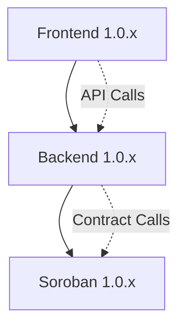

# Component Compatibility Matrix

This document defines the compatibility requirements between the frontend, backend, and soroban components of the Bitcoin Custody Full-Stack Application.

## Version Compatibility Rules

### Semantic Versioning
All components follow [Semantic Versioning](https://semver.org/) (MAJOR.MINOR.PATCH):

- **MAJOR**: Breaking changes that require migration
- **MINOR**: New features that are backward compatible  
- **PATCH**: Bug fixes and small improvements

### Compatibility Requirements

Components are considered compatible when they share the same MAJOR.MINOR version numbers. Patch versions can differ within the same MAJOR.MINOR series.

## Current Compatibility Matrix

| Version Series | Frontend | Backend | Soroban | Status | Notes |
|---------------|----------|---------|---------|---------|-------|
| 1.0.x         | 1.0.x    | 1.0.x   | 1.0.x   | ✅ Active | Initial release series |

## Component Dependencies



### Frontend Dependencies
- **Backend API**: Requires backend version 1.0.x for API compatibility
- **WebSocket**: Real-time updates from backend
- **Authentication**: JWT tokens from backend auth service

### Backend Dependencies  
- **Soroban Contracts**: Requires soroban version 1.0.x for contract interactions
- **Database**: PostgreSQL with Sea-ORM migrations
- **Contract Events**: Monitors blockchain events from soroban contracts

### Soroban Dependencies
- **Stellar Network**: Compatible with Soroban testnet/mainnet
- **Contract Interfaces**: Stable ABI for backend integration
- **Shared Types**: Common data structures across contracts

## Breaking Changes Policy

### Major Version Changes (x.0.0)
Breaking changes that require coordinated updates across all components:

- **API Contract Changes**: Modified request/response formats
- **Database Schema Changes**: Non-backward compatible migrations  
- **Contract Interface Changes**: Modified contract methods or events
- **Authentication Changes**: New auth mechanisms or token formats

### Minor Version Changes (x.y.0)
Backward compatible additions:

- **New API Endpoints**: Additional functionality without breaking existing
- **New Contract Methods**: Additional contract functionality
- **New Features**: UI enhancements that don't break existing workflows
- **Performance Improvements**: Optimizations without interface changes

### Patch Version Changes (x.y.z)
Bug fixes and small improvements:

- **Bug Fixes**: Corrections that don't change interfaces
- **Security Patches**: Security improvements without breaking changes
- **Documentation Updates**: Improved docs and examples
- **Dependency Updates**: Minor dependency version bumps

## Migration Guides

### Upgrading Between Patch Versions (1.0.0 → 1.0.1)
1. Update individual components independently
2. No migration steps required
3. Restart services to pick up changes

### Upgrading Between Minor Versions (1.0.x → 1.1.0)
1. Update all components to new minor version
2. Review new feature documentation
3. Optional: Adopt new features in your workflows
4. Test integration between components

### Upgrading Between Major Versions (1.x.x → 2.0.0)
1. **Review breaking changes** in CHANGELOG.md
2. **Backup production data** before upgrade
3. **Update all components simultaneously** to maintain compatibility
4. **Run migration scripts** if provided
5. **Update configuration files** as needed
6. **Test thoroughly** before production deployment

## Version Validation

Use the version manager script to validate compatibility:

```bash
# Check current versions and compatibility
./scripts/version-manager.sh show

# Validate all components
./scripts/version-manager.sh check

# Check compatibility specifically  
./scripts/version-manager.sh compatibility
```

## Compatibility Testing

### Automated Testing
- **Integration Tests**: Verify cross-component communication
- **Contract Tests**: Validate backend-soroban interactions
- **E2E Tests**: Full workflow testing across all components
- **API Tests**: Verify frontend-backend API compatibility

### Manual Testing Checklist
- [ ] Frontend can authenticate with backend
- [ ] Backend can interact with soroban contracts
- [ ] WebSocket connections work for real-time updates
- [ ] All API endpoints return expected responses
- [ ] Contract events are properly monitored and processed

## Troubleshooting Compatibility Issues

### Common Issues

**Frontend-Backend Version Mismatch**
```
Error: API endpoint not found (404)
```
- **Cause**: Frontend using newer API that doesn't exist in backend
- **Solution**: Ensure frontend and backend have compatible versions

**Backend-Soroban Version Mismatch**  
```
Error: Contract method not found
```
- **Cause**: Backend calling contract method that doesn't exist
- **Solution**: Update soroban contracts or downgrade backend calls

**Authentication Issues**
```
Error: Invalid JWT token format
```
- **Cause**: Token format changed between versions
- **Solution**: Clear browser storage and re-authenticate

### Resolution Steps
1. **Check versions**: Use `./scripts/version-manager.sh show`
2. **Sync versions**: Use `./scripts/version-manager.sh sync <version>`
3. **Validate setup**: Use `./scripts/version-manager.sh check`
4. **Review logs**: Check component logs for specific errors
5. **Consult changelog**: Review CHANGELOG.md for breaking changes

## Release Coordination

### Pre-Release Checklist
- [ ] All components pass individual tests
- [ ] Integration tests pass with new versions
- [ ] Compatibility matrix updated
- [ ] Migration guides written (if needed)
- [ ] Documentation updated
- [ ] Security review completed

### Release Process
1. **Version Planning**: Determine version increments for each component
2. **Compatibility Check**: Ensure versions will be compatible
3. **Testing**: Run full test suite with new versions
4. **Documentation**: Update compatibility matrix and guides
5. **Deployment**: Deploy components in dependency order (soroban → backend → frontend)
6. **Validation**: Verify production deployment works correctly

## Support Matrix

| Component Version | Support Status | End of Life |
|------------------|----------------|-------------|
| 1.0.x            | ✅ Active      | TBD         |

## Contact

For questions about version compatibility or upgrade procedures:
- Review this document and CHANGELOG.md
- Check existing GitHub issues
- Create new issue with compatibility tag
- Contact development team for urgent compatibility issues