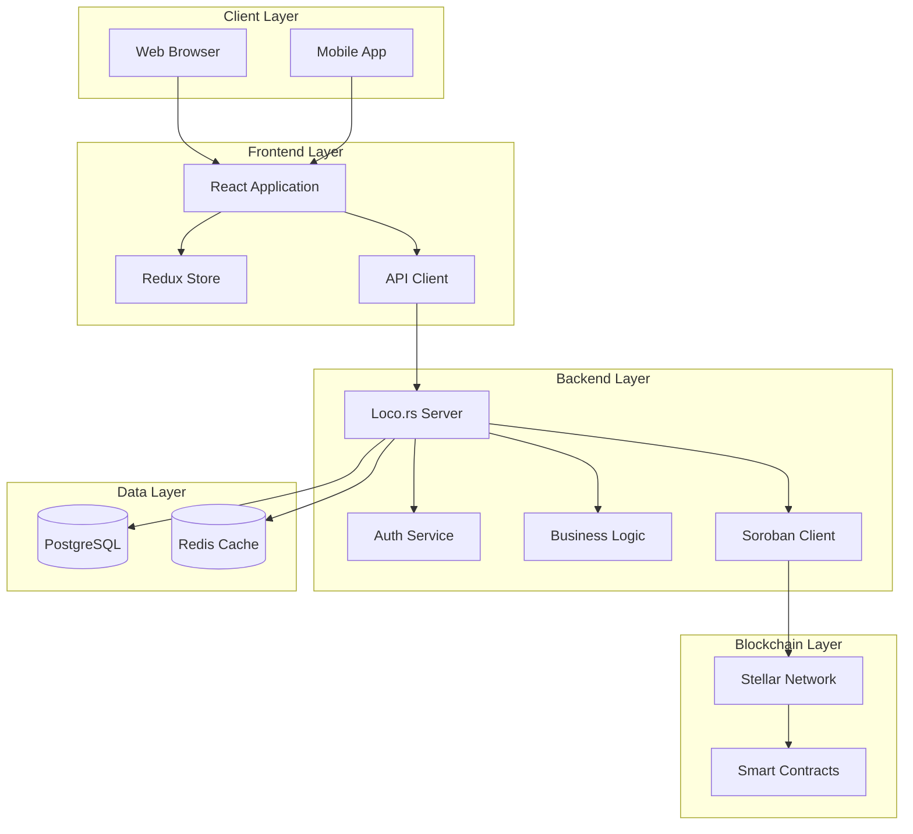
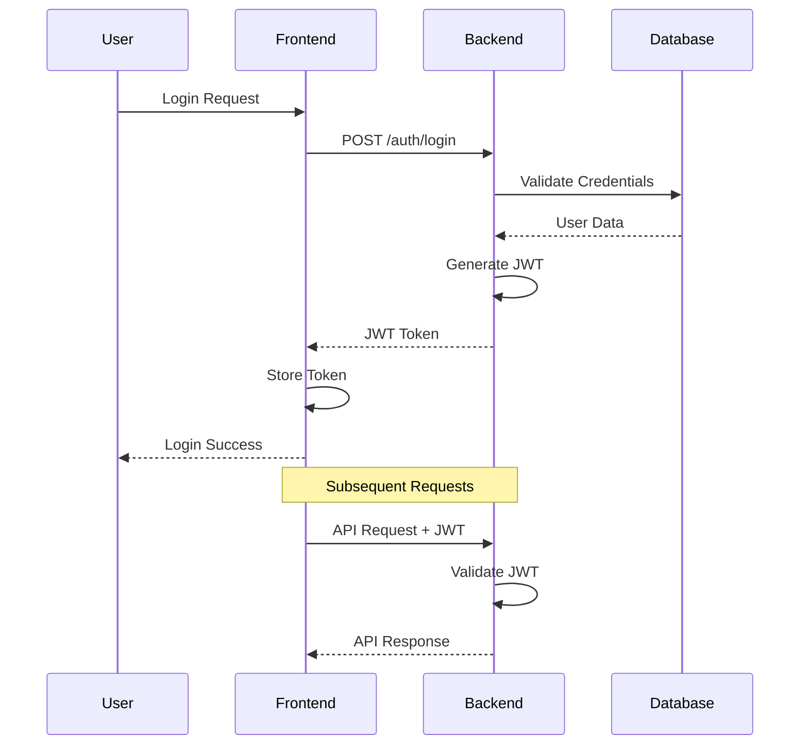

# Architecture Documentation

This directory contains the architecture documentation for the Bitcoin Custody Full-Stack Application, including Architecture Decision Records (ADRs), design patterns, and system documentation.

## Table of Contents

- [Architecture Decision Records (ADRs)](#architecture-decision-records-adrs)
- [System Architecture Overview](#system-architecture-overview)
- [Design Patterns](#design-patterns)
- [Integration Patterns](#integration-patterns)
- [Security Architecture](#security-architecture)

## Architecture Decision Records (ADRs)

ADRs document important architectural decisions made during the development of the project. Each ADR follows a standard format and is numbered sequentially.

### Current ADRs

- [ADR-001: Project Structure Reorganization](./adr-001-project-structure.md)
- [ADR-002: Frontend Technology Stack](./adr-002-frontend-stack.md)
- [ADR-003: Backend Framework Selection](./adr-003-backend-framework.md)
- [ADR-004: Smart Contract Architecture](./adr-004-smart-contract-architecture.md)
- [ADR-005: Database Design and ORM](./adr-005-database-design.md)
- [ADR-006: Authentication and Authorization](./adr-006-auth-strategy.md)
- [ADR-007: API Design and Communication](./adr-007-api-design.md)
- [ADR-008: Development Environment Setup](./adr-008-dev-environment.md)

## System Architecture Overview

### High-Level Architecture



### Component Responsibilities

#### Frontend (React + TypeScript)
- **User Interface**: Responsive web application for all user interactions
- **State Management**: Global application state using Redux Toolkit
- **API Communication**: HTTP and WebSocket communication with backend
- **Form Validation**: Client-side validation and user experience optimization
- **Real-time Updates**: WebSocket integration for live system updates

#### Backend (Loco.rs + PostgreSQL)
- **API Gateway**: RESTful API endpoints for all frontend operations
- **Authentication**: JWT-based authentication and session management
- **Business Logic**: Core application logic and workflow orchestration
- **Database Operations**: Data persistence and complex queries
- **Blockchain Integration**: Smart contract interaction and event monitoring
- **Background Jobs**: Asynchronous processing and scheduled tasks

#### Smart Contracts (Soroban)
- **Integration Router**: Central contract coordinating all operations
- **KYC Registry**: Compliance and identity verification management
- **Token Management**: Bitcoin-backed token minting and burning
- **Reserve Management**: Bitcoin reserve tracking and proof generation
- **Event System**: Blockchain event emission for system coordination

## Design Patterns

### Frontend Patterns

#### Component Architecture Pattern
```typescript
// Container/Presenter Pattern
const BitcoinDepositContainer: React.FC = () => {
  const dispatch = useAppDispatch();
  const { deposits, loading } = useAppSelector(state => state.deposits);
  
  const handleDeposit = useCallback((data: DepositData) => {
    dispatch(createDeposit(data));
  }, [dispatch]);
  
  return (
    <BitcoinDepositForm
      deposits={deposits}
      loading={loading}
      onSubmit={handleDeposit}
    />
  );
};
```

#### Custom Hooks Pattern
```typescript
// Encapsulate complex logic in custom hooks
export const useApiCall = <T>(
  apiFunction: () => Promise<T>,
  dependencies: any[] = []
) => {
  const [data, setData] = useState<T | null>(null);
  const [loading, setLoading] = useState(false);
  const [error, setError] = useState<string | null>(null);
  
  useEffect(() => {
    const fetchData = async () => {
      setLoading(true);
      try {
        const result = await apiFunction();
        setData(result);
        setError(null);
      } catch (err) {
        setError(err instanceof Error ? err.message : 'Unknown error');
      } finally {
        setLoading(false);
      }
    };
    
    fetchData();
  }, dependencies);
  
  return { data, loading, error };
};
```

### Backend Patterns

#### Service Layer Pattern
```rust
// Separate business logic from controllers
pub struct DepositService {
    db: DatabaseConnection,
    soroban_client: SorobanClient,
}

impl DepositService {
    pub async fn process_deposit(
        &self,
        request: CreateDepositRequest,
    ) -> Result<Deposit, ServiceError> {
        // Validate business rules
        self.validate_deposit(&request).await?;
        
        // Create database record
        let deposit = self.create_deposit_record(&request).await?;
        
        // Interact with blockchain
        self.soroban_client
            .execute_deposit(&deposit)
            .await?;
        
        Ok(deposit)
    }
}
```

#### Repository Pattern
```rust
// Abstract database operations
#[async_trait]
pub trait DepositRepository {
    async fn create(&self, deposit: CreateDeposit) -> Result<Deposit>;
    async fn find_by_id(&self, id: &str) -> Result<Option<Deposit>>;
    async fn find_by_user(&self, user_id: &str) -> Result<Vec<Deposit>>;
    async fn update_status(&self, id: &str, status: DepositStatus) -> Result<()>;
}

pub struct PostgresDepositRepository {
    db: DatabaseConnection,
}

#[async_trait]
impl DepositRepository for PostgresDepositRepository {
    async fn create(&self, deposit: CreateDeposit) -> Result<Deposit> {
        // Database implementation
    }
}
```

### Smart Contract Patterns

#### Access Control Pattern
```rust
// Implement role-based access control
fn require_admin(env: &Env) -> Result<(), Error> {
    let admin: Address = env.storage().instance()
        .get(&DataKey::Admin)
        .ok_or(Error::NotInitialized)?;
    
    admin.require_auth();
    Ok(())
}

#[contractimpl]
impl Contract {
    pub fn admin_function(env: Env) -> Result<(), Error> {
        require_admin(&env)?;
        // Admin-only logic
        Ok(())
    }
}
```

#### Event Emission Pattern
```rust
// Consistent event emission for monitoring
fn emit_deposit_event(
    env: &Env,
    user: &Address,
    amount: u64,
    tx_hash: &String,
) {
    env.events().publish((
        symbol_short!("deposit"),
        user.clone(),
    ), (amount, tx_hash.clone()));
}
```

## Integration Patterns

### Frontend-Backend Integration

#### API Client Pattern
```typescript
// Centralized API client with interceptors
class ApiClient {
  private client: AxiosInstance;
  
  constructor() {
    this.client = axios.create({
      baseURL: process.env.REACT_APP_API_URL,
      timeout: 10000,
    });
    
    this.setupInterceptors();
  }
  
  private setupInterceptors() {
    // Request interceptor for auth
    this.client.interceptors.request.use((config) => {
      const token = localStorage.getItem('auth_token');
      if (token) {
        config.headers.Authorization = `Bearer ${token}`;
      }
      return config;
    });
    
    // Response interceptor for error handling
    this.client.interceptors.response.use(
      (response) => response,
      (error) => {
        if (error.response?.status === 401) {
          // Handle unauthorized
          store.dispatch(logout());
        }
        return Promise.reject(error);
      }
    );
  }
}
```

### Backend-Blockchain Integration

#### Event Monitoring Pattern
```rust
// Monitor blockchain events and update database
pub struct EventMonitor {
    soroban_client: SorobanClient,
    deposit_service: DepositService,
}

impl EventMonitor {
    pub async fn start_monitoring(&self) -> Result<()> {
        let mut event_stream = self.soroban_client
            .subscribe_to_events()
            .await?;
        
        while let Some(event) = event_stream.next().await {
            match event.event_type.as_str() {
                "deposit" => {
                    self.handle_deposit_event(event).await?;
                }
                "withdrawal" => {
                    self.handle_withdrawal_event(event).await?;
                }
                _ => {
                    tracing::warn!("Unknown event type: {}", event.event_type);
                }
            }
        }
        
        Ok(())
    }
}
```

## Security Architecture

### Authentication Flow



### Security Layers

1. **Transport Security**: HTTPS/TLS for all communications
2. **Authentication**: JWT tokens with expiration and refresh
3. **Authorization**: Role-based access control (RBAC)
4. **Input Validation**: Comprehensive validation at all layers
5. **Rate Limiting**: API rate limiting and DDoS protection
6. **Data Encryption**: Sensitive data encryption at rest
7. **Audit Logging**: Comprehensive audit trail for all operations

### Smart Contract Security

```rust
// Input validation and bounds checking
fn validate_amount(amount: u64) -> Result<(), Error> {
    if amount == 0 {
        return Err(Error::InvalidAmount);
    }
    
    if amount > MAX_DEPOSIT_AMOUNT {
        return Err(Error::AmountTooLarge);
    }
    
    Ok(())
}

// Reentrancy protection
fn require_not_paused(env: &Env) -> Result<(), Error> {
    let paused: bool = env.storage().instance()
        .get(&DataKey::Paused)
        .unwrap_or(false);
    
    if paused {
        return Err(Error::ContractPaused);
    }
    
    Ok(())
}
```

## Performance Considerations

### Frontend Performance

- **Code Splitting**: Lazy loading of components and routes
- **Memoization**: React.memo and useMemo for expensive computations
- **Virtual Scrolling**: For large lists and tables
- **Image Optimization**: WebP format and responsive images
- **Bundle Optimization**: Tree shaking and minification

### Backend Performance

- **Connection Pooling**: Database connection pool management
- **Caching**: Redis caching for frequently accessed data
- **Async Processing**: Background jobs for heavy operations
- **Query Optimization**: Efficient database queries and indexing
- **Rate Limiting**: Protect against abuse and ensure fair usage

### Blockchain Performance

- **Batch Operations**: Group multiple operations when possible
- **Gas Optimization**: Minimize contract execution costs
- **Event Filtering**: Efficient event monitoring and filtering
- **State Management**: Optimize contract storage usage

## Monitoring and Observability

### Logging Strategy

```rust
// Structured logging with tracing
use tracing::{info, warn, error, instrument};

#[instrument(skip(self))]
pub async fn process_deposit(
    &self,
    request: CreateDepositRequest,
) -> Result<Deposit, ServiceError> {
    info!(
        user_id = %request.user_id,
        amount = request.amount,
        "Processing deposit request"
    );
    
    match self.validate_deposit(&request).await {
        Ok(_) => info!("Deposit validation successful"),
        Err(e) => {
            warn!(error = %e, "Deposit validation failed");
            return Err(e);
        }
    }
    
    // Process deposit...
    
    info!(deposit_id = %deposit.id, "Deposit processed successfully");
    Ok(deposit)
}
```

### Metrics Collection

- **Application Metrics**: Request rates, response times, error rates
- **Business Metrics**: Deposit volumes, user activity, system health
- **Infrastructure Metrics**: CPU, memory, disk usage, network traffic
- **Blockchain Metrics**: Transaction success rates, gas usage, event processing

This architecture documentation provides a comprehensive overview of the system design, patterns, and decisions that guide the development of the Bitcoin Custody Full-Stack Application.