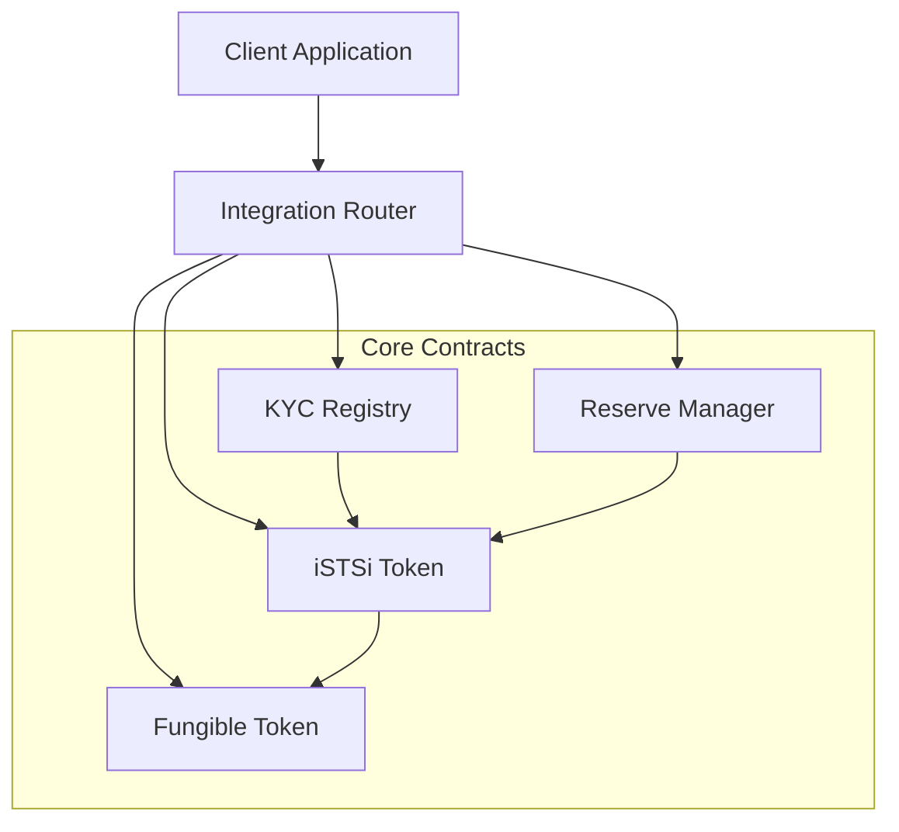

# Integration Documentation

This documentation provides comprehensive guidance for integrating with the iSHS-XLM token ecosystem, including KYC Registry, Reserve Manager, iSTSi Token, and Fungible Token contracts.

## Table of Contents

- [Quick Start](#quick-start)
- [Architecture Overview](#architecture-overview)
- [Contract Addresses](#contract-addresses)
- [API Reference](#api-reference)
- [Integration Patterns](#integration-patterns)
- [Error Handling](#error-handling)
- [Security Considerations](#security-considerations)
- [Testing](#testing)
- [Monitoring](#monitoring)
- [Support](#support)

## Quick Start

### Prerequisites

- Stellar CLI installed and configured
- Access to Stellar network (testnet/mainnet)
- Basic understanding of Stellar smart contracts

### Basic Integration

```bash
# 1. Install Stellar CLI
curl -L https://github.com/stellar/stellar-cli/releases/download/v21.0.0/stellar-cli-21.0.0-x86_64-unknown-linux-gnu.tar.gz | tar -xz
sudo mv stellar /usr/local/bin/

# 2. Configure network
stellar network add --global testnet \
  --rpc-url https://soroban-testnet.stellar.org:443 \
  --network-passphrase "Test SDF Network ; September 2015"

# 3. Get contract addresses
curl -s https://api.example.com/contracts/addresses | jq .

# 4. Test basic functionality
stellar contract invoke \
  --id CKYC_REGISTRY_ADDRESS \
  --network testnet \
  -- get_user_tier \
  --user YOUR_ADDRESS
```

## Architecture Overview

The integration consists of four main contracts working together:



### Contract Responsibilities

- **KYC Registry**: User verification and tier management
- **Reserve Manager**: Collateral and reserve ratio management
- **iSTSi Token**: Stablecoin with KYC and reserve backing
- **Fungible Token**: Standard token functionality
- **Integration Router**: Unified interface for complex operations## Cont
ract Addresses

### Testnet
```json
{
  "network": "testnet",
  "contracts": {
    "kyc_registry": "CKYC_TESTNET_ADDRESS",
    "reserve_manager": "CRESERVE_TESTNET_ADDRESS",
    "istsi_token": "CISTSI_TESTNET_ADDRESS",
    "fungible_token": "CFUNGIBLE_TESTNET_ADDRESS",
    "integration_router": "CROUTER_TESTNET_ADDRESS"
  }
}
```

### Mainnet
```json
{
  "network": "mainnet",
  "contracts": {
    "kyc_registry": "CKYC_MAINNET_ADDRESS",
    "reserve_manager": "CRESERVE_MAINNET_ADDRESS",
    "istsi_token": "CISTSI_MAINNET_ADDRESS",
    "fungible_token": "CFUNGIBLE_MAINNET_ADDRESS",
    "integration_router": "CROUTER_MAINNET_ADDRESS"
  }
}
```

## API Reference

### KYC Registry

#### User Management

**Register User**
```bash
stellar contract invoke \
  --id $KYC_REGISTRY \
  --network $NETWORK \
  -- register_user \
  --user $USER_ADDRESS \
  --tier 1
```

**Get User Tier**
```bash
stellar contract invoke \
  --id $KYC_REGISTRY \
  --network $NETWORK \
  -- get_user_tier \
  --user $USER_ADDRESS
```

**Update User Tier**
```bash
stellar contract invoke \
  --id $KYC_REGISTRY \
  --network $NETWORK \
  -- update_user_tier \
  --user $USER_ADDRESS \
  --new_tier 2
```

#### Tier Management

**Set Tier Limits**
```bash
stellar contract invoke \
  --id $KYC_REGISTRY \
  --network $NETWORK \
  -- set_tier_limits \
  --tier 1 \
  --daily_limit 1000000000 \
  --monthly_limit 10000000000
```

**Get Tier Limits**
```bash
stellar contract invoke \
  --id $KYC_REGISTRY \
  --network $NETWORK \
  -- get_tier_limits \
  --tier 1
```

### Reserve Manager

#### Reserve Operations

**Add Reserves**
```bash
stellar contract invoke \
  --id $RESERVE_MANAGER \
  --network $NETWORK \
  -- add_reserves \
  --amount 1000000000
```

**Remove Reserves**
```bash
stellar contract invoke \
  --id $RESERVE_MANAGER \
  --network $NETWORK \
  -- remove_reserves \
  --amount 500000000
```

**Get Reserve Ratio**
```bash
stellar contract invoke \
  --id $RESERVE_MANAGER \
  --network $NETWORK \
  -- get_reserve_ratio
```

#### Threshold Management

**Set Reserve Threshold**
```bash
stellar contract invoke \
  --id $RESERVE_MANAGER \
  --network $NETWORK \
  -- set_reserve_threshold \
  --threshold 9000  # 90%
```

### iSTSi Token

#### Token Operations

**Mint Tokens**
```bash
stellar contract invoke \
  --id $ISTSI_TOKEN \
  --network $NETWORK \
  -- mint \
  --to $USER_ADDRESS \
  --amount 1000000000
```

**Transfer Tokens**
```bash
stellar contract invoke \
  --id $ISTSI_TOKEN \
  --network $NETWORK \
  -- transfer \
  --from $FROM_ADDRESS \
  --to $TO_ADDRESS \
  --amount 500000000
```

**Burn Tokens**
```bash
stellar contract invoke \
  --id $ISTSI_TOKEN \
  --network $NETWORK \
  -- burn \
  --from $USER_ADDRESS \
  --amount 250000000
```

#### Balance and Allowance

**Get Balance**
```bash
stellar contract invoke \
  --id $ISTSI_TOKEN \
  --network $NETWORK \
  -- balance \
  --id $USER_ADDRESS
```

**Approve Allowance**
```bash
stellar contract invoke \
  --id $ISTSI_TOKEN \
  --network $NETWORK \
  -- approve \
  --from $OWNER_ADDRESS \
  --spender $SPENDER_ADDRESS \
  --amount 1000000000 \
  --expiration_ledger 1000000
```### Int
egration Router

#### Complex Operations

**Mint with KYC Check**
```bash
stellar contract invoke \
  --id $INTEGRATION_ROUTER \
  --network $NETWORK \
  -- mint_with_kyc \
  --user $USER_ADDRESS \
  --amount 1000000000
```

**Transfer with Limits**
```bash
stellar contract invoke \
  --id $INTEGRATION_ROUTER \
  --network $NETWORK \
  -- transfer_with_limits \
  --from $FROM_ADDRESS \
  --to $TO_ADDRESS \
  --amount 500000000
```

**Burn with Reserve Update**
```bash
stellar contract invoke \
  --id $INTEGRATION_ROUTER \
  --network $NETWORK \
  -- burn_with_reserve_update \
  --user $USER_ADDRESS \
  --amount 250000000
```

## Integration Patterns

### Pattern 1: User Onboarding

```bash
#!/bin/bash
# Complete user onboarding flow

USER_ADDRESS="$1"
INITIAL_TIER=1

# 1. Register user in KYC
stellar contract invoke \
  --id $KYC_REGISTRY \
  --network $NETWORK \
  -- register_user \
  --user $USER_ADDRESS \
  --tier $INITIAL_TIER

# 2. Verify registration
TIER=$(stellar contract invoke \
  --id $KYC_REGISTRY \
  --network $NETWORK \
  -- get_user_tier \
  --user $USER_ADDRESS)

echo "User $USER_ADDRESS registered with tier: $TIER"
```

### Pattern 2: Token Minting with Compliance

```bash
#!/bin/bash
# Mint tokens with full compliance checks

USER_ADDRESS="$1"
AMOUNT="$2"

# 1. Check user KYC status
TIER=$(stellar contract invoke \
  --id $KYC_REGISTRY \
  --network $NETWORK \
  -- get_user_tier \
  --user $USER_ADDRESS)

if [ "$TIER" = "0" ]; then
  echo "Error: User not KYC verified"
  exit 1
fi

# 2. Check reserve ratio
RATIO=$(stellar contract invoke \
  --id $RESERVE_MANAGER \
  --network $NETWORK \
  -- get_reserve_ratio)

if [ "$RATIO" -lt "9000" ]; then
  echo "Error: Insufficient reserves"
  exit 1
fi

# 3. Mint tokens
stellar contract invoke \
  --id $ISTSI_TOKEN \
  --network $NETWORK \
  -- mint \
  --to $USER_ADDRESS \
  --amount $AMOUNT

echo "Minted $AMOUNT tokens to $USER_ADDRESS"
```

### Pattern 3: Batch Operations

```bash
#!/bin/bash
# Process multiple operations in batch

BATCH_FILE="$1"

while IFS=',' read -r operation user amount; do
  case "$operation" in
    "mint")
      stellar contract invoke \
        --id $INTEGRATION_ROUTER \
        --network $NETWORK \
        -- mint_with_kyc \
        --user $user \
        --amount $amount
      ;;
    "burn")
      stellar contract invoke \
        --id $INTEGRATION_ROUTER \
        --network $NETWORK \
        -- burn_with_reserve_update \
        --user $user \
        --amount $amount
      ;;
    *)
      echo "Unknown operation: $operation"
      ;;
  esac
done < "$BATCH_FILE"
```

## Error Handling

### Common Error Codes

| Error Code | Description | Resolution |
|------------|-------------|------------|
| `KYC_NOT_VERIFIED` | User not KYC verified | Complete KYC process |
| `INSUFFICIENT_TIER` | User tier too low | Upgrade user tier |
| `DAILY_LIMIT_EXCEEDED` | Daily transaction limit exceeded | Wait for next day or upgrade tier |
| `MONTHLY_LIMIT_EXCEEDED` | Monthly transaction limit exceeded | Wait for next month or upgrade tier |
| `INSUFFICIENT_RESERVES` | Reserve ratio too low | Add more reserves |
| `UNAUTHORIZED` | Caller not authorized | Use authorized account |
| `INVALID_AMOUNT` | Amount is zero or negative | Use positive amount |
| `INSUFFICIENT_BALANCE` | Not enough tokens | Check balance |

### Error Handling Examples

```bash
#!/bin/bash
# Error handling example

handle_error() {
  local error_output="$1"
  
  if echo "$error_output" | grep -q "KYC_NOT_VERIFIED"; then
    echo "Error: Please complete KYC verification first"
    echo "Contact support at kyc@example.com"
  elif echo "$error_output" | grep -q "INSUFFICIENT_RESERVES"; then
    echo "Error: System reserves too low"
    echo "Please try again later or contact support"
  else
    echo "Unexpected error: $error_output"
  fi
}

# Example usage
OUTPUT=$(stellar contract invoke \
  --id $ISTSI_TOKEN \
  --network $NETWORK \
  -- mint \
  --to $USER_ADDRESS \
  --amount $AMOUNT 2>&1)

if [ $? -ne 0 ]; then
  handle_error "$OUTPUT"
  exit 1
fi

echo "Operation successful: $OUTPUT"
```## Securit
y Considerations

### Access Control

1. **Admin Functions**: Only contract admins can perform administrative operations
2. **User Verification**: All operations require proper KYC verification
3. **Rate Limiting**: Daily and monthly limits prevent abuse
4. **Reserve Requirements**: Minting requires sufficient reserves

### Best Practices

1. **Always verify user KYC status before operations**
2. **Check reserve ratios before minting**
3. **Use appropriate error handling**
4. **Monitor transaction limits**
5. **Keep private keys secure**
6. **Use testnet for development**

### Security Checklist

- [ ] User KYC verification implemented
- [ ] Reserve ratio checks in place
- [ ] Transaction limits enforced
- [ ] Error handling comprehensive
- [ ] Access controls verified
- [ ] Private keys secured
- [ ] Monitoring configured

## Testing

### Unit Tests

```bash
# Run contract unit tests
cd contracts/kyc_registry && cargo test
cd contracts/reserve_manager && cargo test
cd contracts/istsi_token && cargo test
```

### Integration Tests

```bash
# Run integration tests
./scripts/test_deployment.sh
```

### Load Testing

```bash
# Run load tests
./scripts/load_test.sh --users 100 --operations 1000
```

## Monitoring

### Key Metrics

1. **Reserve Ratio**: Monitor reserve backing
2. **Transaction Volume**: Track daily/monthly volumes
3. **KYC Status**: Monitor user verification rates
4. **Error Rates**: Track operation failures
5. **Response Times**: Monitor performance

### Monitoring Setup

```bash
# Set up monitoring
./scripts/setup_monitoring.sh --network mainnet
```

### Alerts

Configure alerts for:
- Reserve ratio below threshold
- High error rates
- Unusual transaction patterns
- System downtime

## Support

### Documentation
- [API Reference](./api-reference.md)
- [Error Codes](./error-codes.md)
- [Security Guide](./security.md)

### Contact
- Technical Support: tech-support@example.com
- KYC Issues: kyc@example.com
- Emergency: emergency@example.com

### Community
- Discord: https://discord.gg/example
- GitHub: https://github.com/example/istsi-token
- Forum: https://forum.example.com