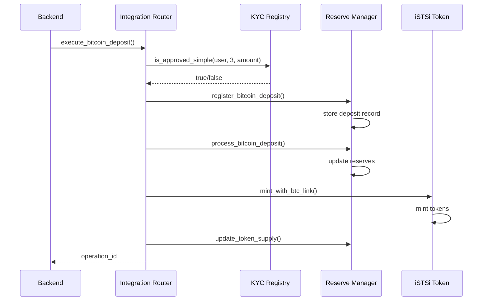
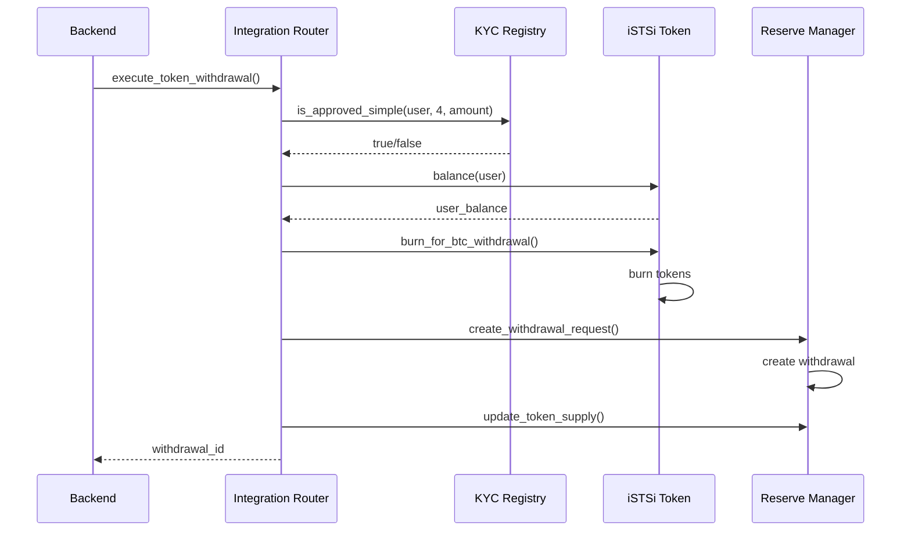

# Contract ABIs and Interaction Patterns

This document provides comprehensive documentation of the Application Binary Interfaces (ABIs) for all contracts in the Bitcoin custody system, along with interaction patterns and integration examples.

## Table of Contents

1. [Integration Router Contract](#integration-router-contract)
2. [KYC Registry Contract](#kyc-registry-contract)
3. [iSTSi Token Contract](#istsi-token-contract)
4. [Reserve Manager Contract](#reserve-manager-contract)
5. [Interaction Patterns](#interaction-patterns)
6. [Error Handling](#error-handling)
7. [Event Monitoring](#event-monitoring)

## Integration Router Contract

The Integration Router serves as the central orchestrator for all cross-contract operations.

### Contract Address
- **Testnet**: `CXXXXXXXXXXXXXXXXXXXXXXXXXXXXXXXXXXXXXXXXXXXXXXXXXXXXXXX`
- **Mainnet**: `CXXXXXXXXXXXXXXXXXXXXXXXXXXXXXXXXXXXXXXXXXXXXXXXXXXXXXXX`

### Core Functions

#### `execute_bitcoin_deposit`
Orchestrates the complete Bitcoin deposit workflow.

**Function Signature:**
```rust
pub fn execute_bitcoin_deposit(
    env: Env,
    caller: Address,
    user: Address,
    btc_amount: u64,
    btc_tx_hash: BytesN<32>,
    confirmations: u32
) -> BytesN<32>
```

**Parameters:**
- `caller`: Address of the calling service (must be authorized)
- `user`: User address receiving the tokens
- `btc_amount`: Amount of Bitcoin deposited (in satoshis)
- `btc_tx_hash`: Bitcoin transaction hash (32 bytes)
- `confirmations`: Number of Bitcoin confirmations

**Returns:**
- `BytesN<32>`: Unique operation ID for tracking

**Events Emitted:**
```rust
(symbol_short!("btc_dep"), user, operation_id) => (btc_amount, confirmations, timestamp)
```

#### `execute_token_withdrawal`
Orchestrates the complete token withdrawal workflow.

**Function Signature:**
```rust
pub fn execute_token_withdrawal(
    env: Env,
    caller: Address,
    user: Address,
    istsi_amount: u64,
    btc_address: String
) -> BytesN<32>
```

**Parameters:**
- `caller`: Address of the calling service
- `user`: User address withdrawing tokens
- `istsi_amount`: Amount of iSTSi tokens to burn
- `btc_address`: Bitcoin address for withdrawal

**Returns:**
- `BytesN<32>`: Unique withdrawal ID

**Events Emitted:**
```rust
(symbol_short!("tok_with"), user, withdrawal_id) => (istsi_amount, btc_address)
```

#### `execute_cross_token_exchange`
Executes cross-token exchange operations.

**Function Signature:**
```rust
pub fn execute_cross_token_exchange(
    env: Env,
    caller: Address,
    user: Address,
    from_token: Address,
    to_token: Address,
    from_amount: u64
) -> (BytesN<32>, u64)
```

**Parameters:**
- `caller`: Address of the calling service
- `user`: User address executing the exchange
- `from_token`: Source token contract address
- `to_token`: Destination token contract address
- `from_amount`: Amount of source tokens to exchange

**Returns:**
- `(BytesN<32>, u64)`: Operation ID and amount received

### Administrative Functions

#### `emergency_pause`
Pauses all system operations (admin only).

**Function Signature:**
```rust
pub fn emergency_pause(env: Env, caller: Address, reason: String)
```

#### `resume_operations`
Resumes system operations (admin only).

**Function Signature:**
```rust
pub fn resume_operations(env: Env, caller: Address)
```

## KYC Registry Contract

The KYC Registry manages compliance verification and address allowlists.

### Contract Address
- **Testnet**: `CXXXXXXXXXXXXXXXXXXXXXXXXXXXXXXXXXXXXXXXXXXXXXXXXXXXXXXX`
- **Mainnet**: `CXXXXXXXXXXXXXXXXXXXXXXXXXXXXXXXXXXXXXXXXXXXXXXXXXXXXXXX`

### Core Functions

#### `is_approved_simple`
Simplified compliance check for cross-contract calls.

**Function Signature:**
```rust
pub fn is_approved_simple(
    env: Env,
    address: Address,
    op_code: u32,
    amount: i128
) -> bool
```

**Parameters:**
- `address`: Address to check
- `op_code`: Operation code (0=Transfer, 1=Mint, 2=Burn, 3=Deposit, 4=Withdraw, 5=Exchange)
- `amount`: Amount for the operation

**Returns:**
- `bool`: Whether the operation is approved

#### `get_tier_code_by_address`
Returns the KYC tier for an address.

**Function Signature:**
```rust
pub fn get_tier_code_by_address(env: Env, address: Address) -> u32
```

**Parameters:**
- `address`: Address to check

**Returns:**
- `u32`: KYC tier (0=None, 1=Basic, 2=Verified, 3=Enhanced, 4=Institutional)

#### `register_customer`
Registers a new customer with KYC information.

**Function Signature:**
```rust
pub fn register_customer(
    env: Env,
    caller: Address,
    customer_id: String,
    kyc_tier: KYCTier,
    addresses: Vec<Address>,
    jurisdiction: String,
    metadata: Map<String, String>
)
```

### Administrative Functions

#### `set_registry_enabled`
Enable/disable the registry globally.

#### `update_customer_tier`
Update a customer's KYC tier.

#### `add_approved_address`
Add an approved address to a customer.

## iSTSi Token Contract

The iSTSi Token contract manages Bitcoin-backed token operations with integrated compliance.

### Contract Address
- **Testnet**: `CXXXXXXXXXXXXXXXXXXXXXXXXXXXXXXXXXXXXXXXXXXXXXXXXXXXXXXX`
- **Mainnet**: `CXXXXXXXXXXXXXXXXXXXXXXXXXXXXXXXXXXXXXXXXXXXXXXXXXXXXXXX`

### Core Functions

#### `mint_with_btc_link`
Mints tokens with Bitcoin transaction linking.

**Function Signature:**
```rust
pub fn mint_with_btc_link(
    env: Env,
    caller: Address,
    recipient: Address,
    amount: i128,
    btc_tx_hash: BytesN<32>
)
```

**Parameters:**
- `caller`: Address of the calling service
- `recipient`: Address to receive minted tokens
- `amount`: Amount to mint (with 8 decimals)
- `btc_tx_hash`: Bitcoin transaction hash for linking

**Events Emitted:**
```rust
(symbol_short!("mint_btc"), recipient) => (amount, btc_tx_hash, correlation_id)
```

#### `burn_for_btc_withdrawal`
Burns tokens for Bitcoin withdrawal.

**Function Signature:**
```rust
pub fn burn_for_btc_withdrawal(
    env: Env,
    caller: Address,
    from: Address,
    amount: i128,
    btc_address: String
) -> BytesN<32>
```

**Parameters:**
- `caller`: Address of the calling service
- `from`: Address to burn tokens from
- `amount`: Amount to burn
- `btc_address`: Bitcoin address for withdrawal

**Returns:**
- `BytesN<32>`: Withdrawal request ID

#### `compliance_transfer`
Executes transfer with integrated compliance verification.

**Function Signature:**
```rust
pub fn compliance_transfer(
    env: Env,
    from: Address,
    to: Address,
    amount: i128
)
```

### Query Functions

#### `get_integrated_mint_record`
Retrieves mint record by Bitcoin transaction hash.

#### `get_integrated_burn_record`
Retrieves burn record by request ID.

#### `is_integration_enabled`
Checks if integration features are enabled.

## Reserve Manager Contract

The Reserve Manager handles Bitcoin reserves and proof-of-reserves generation.

### Contract Address
- **Testnet**: `CXXXXXXXXXXXXXXXXXXXXXXXXXXXXXXXXXXXXXXXXXXXXXXXXXXXXXXX`
- **Mainnet**: `CXXXXXXXXXXXXXXXXXXXXXXXXXXXXXXXXXXXXXXXXXXXXXXXXXXXXXXX`

### Core Functions

#### `register_bitcoin_deposit`
Registers a Bitcoin deposit transaction.

**Function Signature:**
```rust
pub fn register_bitcoin_deposit(
    env: Env,
    caller: Address,
    tx_hash: BytesN<32>,
    amount: u64,
    confirmations: u32,
    user: Address,
    block_height: u64
)
```

#### `process_bitcoin_deposit`
Processes a confirmed Bitcoin deposit.

**Function Signature:**
```rust
pub fn process_bitcoin_deposit(
    env: Env,
    caller: Address,
    tx_hash: BytesN<32>
)
```

#### `create_withdrawal_request`
Creates a Bitcoin withdrawal request.

**Function Signature:**
```rust
pub fn create_withdrawal_request(
    env: Env,
    caller: Address,
    user: Address,
    amount: u64,
    btc_address: String
) -> BytesN<32>
```

#### `generate_proof_of_reserves`
Generates cryptographic proof of reserves.

**Function Signature:**
```rust
pub fn generate_proof_of_reserves(
    env: Env,
    caller: Address
) -> ProofOfReserves
```

### Query Functions

#### `get_reserve_ratio`
Returns current reserve ratio in basis points.

#### `get_total_reserves`
Returns total Bitcoin reserves.

#### `get_total_token_supply`
Returns total token supply.

## Interaction Patterns

### Bitcoin Deposit Workflow



### Token Withdrawal Workflow



### Cross-Contract Error Handling

All contracts implement consistent error handling:

```rust
#[contracterror]
#[derive(Copy, Clone, Debug, Eq, PartialEq)]
pub enum IntegrationError {
    // Authentication & Authorization
    Unauthorized = 1,
    InsufficientPermissions = 2,
    
    // Contract Communication
    ContractNotFound = 10,
    ContractCallFailed = 11,
    InvalidContractResponse = 12,
    
    // Compliance & KYC
    ComplianceCheckFailed = 20,
    InsufficientKYCTier = 21,
    AddressBlacklisted = 22,
    
    // Reserve Management
    InsufficientReserves = 30,
    ReserveRatioTooLow = 31,
    BitcoinTransactionFailed = 32,
    
    // Operation Processing
    OperationTimeout = 40,
    InvalidOperationState = 41,
    DuplicateOperation = 42,
    
    // System State
    SystemPaused = 50,
    EmergencyMode = 51,
    MaintenanceMode = 52,
}
```

## Event Monitoring

### Event Types and Structures

#### Bitcoin Deposit Events
```rust
// Event: btc_dep
Topics: [user_address, operation_id]
Data: (btc_amount, istsi_amount, confirmations, timestamp)
```

#### Token Withdrawal Events
```rust
// Event: tok_with
Topics: [user_address, withdrawal_id]
Data: (istsi_amount, btc_amount, btc_address, timestamp)
```

#### Compliance Check Events
```rust
// Event: kyc_chk
Topics: [user_address, operation_type]
Data: (amount, approved, tier_required, user_tier)
```

#### Reserve Update Events
```rust
// Event: supply
Topics: [caller_address]
Data: (old_supply, new_supply, reserve_ratio, timestamp)
```

### Event Monitoring Best Practices

1. **Subscribe to Multiple Event Types**: Monitor events from all relevant contracts
2. **Implement Retry Logic**: Handle temporary network issues gracefully
3. **Maintain Event Order**: Process events in chronological order
4. **Store Event History**: Keep a local database of processed events
5. **Handle Reorgs**: Be prepared for blockchain reorganizations

### Sample Event Monitoring Code

```rust
use soroban_client::EventMonitor;

let mut monitor = EventMonitor::new(env);

// Subscribe to Bitcoin deposit events
monitor.subscribe(
    "bitcoin_deposits".to_string(),
    EventFilter::new()
        .for_event_types(vec!["btc_dep".to_string()])
        .for_contracts(vec![integration_router_address]),
    |event| {
        match &event.data {
            EventData::BitcoinDeposit { user, btc_amount, .. } => {
                println!("Bitcoin deposit: {} satoshis for user {}", btc_amount, user);
                // Process the deposit...
                Ok(())
            }
            _ => Ok(())
        }
    }
)?;

// Process events
let events = fetch_events_from_network()?;
monitor.process_events(events)?;
```

## Integration Examples

### Backend Service Integration

```rust
use soroban_client::{ContractManager, ContractAddresses, NetworkConfig};

// Initialize contract manager
let addresses = ContractAddresses::from_config(config_map)?;
let network = NetworkConfig::testnet();
let manager = ContractManager::new(env, addresses, network)?;

// Execute Bitcoin deposit
let operation_id = manager.execute_bitcoin_deposit_workflow(
    &ctx,
    &user_address,
    100_000_000, // 1 BTC in satoshis
    &btc_tx_hash,
    6, // confirmations
    800000, // block height
)?;

// Monitor operation status
let status = manager.integration_router().get_operation_status(&operation_id)?;
```

### Error Handling Example

```rust
match manager.execute_bitcoin_deposit_workflow(&ctx, &user, amount, &tx_hash, confirmations, block_height) {
    Ok(operation_id) => {
        println!("Deposit initiated: {}", operation_id);
    }
    Err(ContractError::Integration(IntegrationError::ComplianceCheckFailed)) => {
        println!("User failed KYC compliance check");
    }
    Err(ContractError::Integration(IntegrationError::InsufficientReserves)) => {
        println!("Insufficient reserves for operation");
    }
    Err(ContractError::NetworkError(msg)) => {
        println!("Network error: {}", msg);
    }
    Err(e) => {
        println!("Unexpected error: {:?}", e);
    }
}
```

This documentation provides the foundation for integrating with the Bitcoin custody system contracts. For specific implementation details, refer to the individual contract source code and the client library documentation.